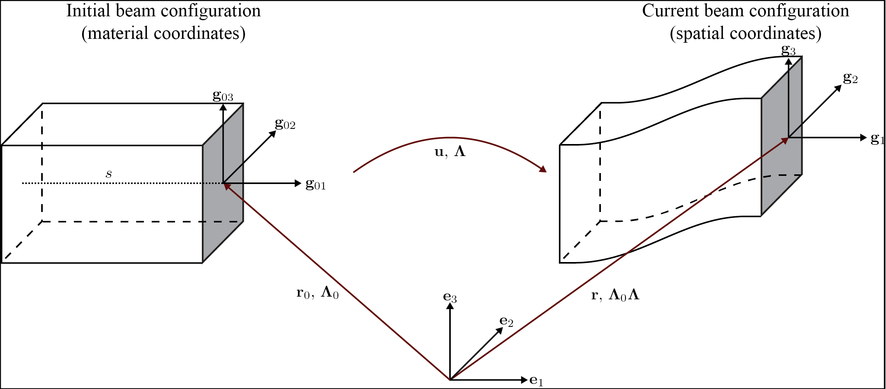

# Geometrically Exact Beams (Simo-Reissner beams) for FEniCS Arclength

## Introduction
Geometrically exact beams: kinematic assumptions are based on 3D continuum theory while the consitutive law is postulated.
Some useful resources papers:
1. Review on geometrically exact beam formulations nomenclature: https://link.springer.com/content/pdf/10.1007/s11831-017-9232-5.pdf
2. Paper with good notes on geometrically exact beams with finite rotations:  https://www.sciencedirect.com/science/article/pii/S0045782519307030
3. Geometrically Exact beams + contact formulation : https://www.sciencedirect.com/science/article/pii/S0020768317303372
4. Cristfield's notes on strain objectiviy. Also contains a good derivation of the strains and principle of virtual work in the Appendix. https://royalsocietypublishing.org/doi/epdf/10.1098/rspa.1999.0352
5. Singularities in rotation parameterization: http://entsphere.com/pub/pdf/rotations/On%20the%20choice%20of%20finite%20rotation%20parameters.pdf
6. A detailed derivation of the weak form and implementation details of Simo-Reissner Beams:
https://www.sciencedirect.com/science/article/pii/0045782586900794
7. A good explaination on nonconservative loads. Section 2.3.1 explains applied non-conservative moments:
https://www.sciencedirect.com/science/article/abs/pii/0045782579900835


Useful FEniCS tutorials:
1. Linear Elastic Geometrically exact beams with finite rotations https://comet-fenics.readthedocs.io/en/latest/demo/finite_rotation_beam/finite_rotation_nonlinear_beam.html
2. 3D Linear Timoshenko Beams: https://comet-fenics.readthedocs.io/en/latest/demo/beams_3D/beams_3D.html

This code is based off 2D geometrically exact formulations.

## 3D Geometrically Exact Beams



### Kinematics


Following the notation of the figure, the beam configuration defined using a centerline curve of the initial beam configuration $s$ through the centroid of the beams and a field of orthonormal triads $\{\mathbf g_1, \mathbf g_2,  \mathbf g_3 \}$ that determine the cross-section orientation, $\mathbf r_0(s)$ is the vector from the global coordinate frame to a initial configuration of the beam and $\mathbf r(s)$ is the vector from the global coordinate frame to the beam current configuration. The rotation tensor $\Lambda$ maps the rotation from the initial orthornormal triads (e.g. the material triads) $\{\mathbf g_{01}, \mathbf g_{02},  \mathbf g_{03} \}$ to the current orthonormal triads (e.g. the spatial triads) $\{\mathbf g_1, \mathbf g_2,  \mathbf g_3 \}$. 

The direction of the triad is the tangent direction of the beams and the other two triads are the principal axes of the beam.

The transformation from the global orthogonal basis $\{ \mathbf e_1, \mathbf e_2, \mathbf e_3 \}$ to the beam orthogonal basis is:

$$
\mathbf g_{0i} = \mathbf \Lambda_0 \mathbf E_i
$$

Therefore, $\mathbf\Lambda$ is constructed by:

$$
\mathbf \Lambda_0 = \mathbf g_{0i} \otimes \mathbf e_i
$$

where  $i=2$ for 2D beams and $i=3$ for 3D beams (Note: Einstein summation is implied here).
Therefore, the motion of the beam can be expressed as:

$$
\mathbf r(s) = \mathbf r_0(s) + \mathbf u(s)
$$

and the rotation of the material triads are:

$$
\mathbf g_i(s) = \mathbf \Lambda \mathbf g_{0i} = \mathbf{\Lambda \Lambda}_0 \mathbf e_i
$$

#### Constructing Initial Beam Triads
The inital beam traids are constructed as follows.
1. The first direction is the beam tangent direction:

$$
\mathbf{g}_{01} = \mathbf{r}_{0,s}
$$
 
where $\dots_{,s}$ is the directional derivative with respect to the beam tangent $s$ (e.g. $\mathbf r_{0,s} =  \frac{d \mathbf r_0}{d s} $). 

2. Find $\mathbf g_{02}$ by finding a vector that is both perpendicular to $\mathbf g_{01}$ and $\mathbf e_3$. E.g.:

$$
\mathbf g_{02} = \mathbf e_3 \times \mathbf g_{01}
$$

3. Find $\mathbf g_{03}$ by finding a vecor that is both perpendicular to $\mathbf g_{02}$ and $\mathbf g_{01}$. E.g.:

$$
\mathbf g_{03} = \mathbf g_{01} \times \mathbf g_{02}
$$

#### Translational Strain

The objective *material* translational strain measures for the case where the beam tangent is rotated with respect to $\mathbf{e}_1$ are (See Crisfield's paper for a detailed derivation):

$$
\mathbf{\epsilon} = \mathbf{\Lambda}_0^\top \mathbf{\Lambda}^\top \frac{d\mathbf{r}(s)}{d s} - \mathbf{e}_1
$$

or equivalently (as implemented in the code:)

$$
\mathbf{\epsilon} = \mathbf{\Lambda}_0^\top(\mathbf{\Lambda}^\top (\mathbf{u}_{,s} + \mathbf{g}_{01}) - \mathbf{g}_{01})
$$

Reminder: $\dots_{,s}$ is the directional derivative with respect to the beam tangent $s$ in material coordinates (In the code it is implemented as $\mathbf u_{,s} = \nabla \mathbf u \cdot \frac{d \mathbf r_0}{d s} = \nabla \mathbf u \cdot \mathbf g_{01} $). 

*Checking for equivalence between theory and FEniCS implementation*

Note that

$$
\frac{d \mathbf{r}}{ds} = \frac{d}{ds}(\mathbf{r}_0(s) + \mathbf{u}(s))=\mathbf{u}_{,s} + \mathbf{g}_{01}
$$

and 

$$
\mathbf{\Lambda}_0^\top \mathbf{g}_{01}= \mathbf{e}_1
$$

by definition. Combining these two equations shows that the FEniCS implementation is equivalent to theory.

#### Rotational Strain
The objective translational strain measures for the case where the beam tangent is rotated with respect to $\mathbf{e}_1$ are (See Crisfield's paper for a detailed derivation):

$$
\mathbf{\chi} = \text{axial}(\mathbf{\Lambda}^\top \mathbf{\Lambda}_{,s} - \mathbf{\Lambda}^\top \mathbf{\Lambda}_{0,s})
$$

Where $\text{axial}(.)$ denotes the vector from associated with the skew symmetric matrix s.t.:

$$
\text{axial}(\mathbf{A}) \mathbf{b} = \mathbf{a} \times \mathbf{b}
$$

with 

```math
\mathbf{A}=\begin{bmatrix}
0 & -a_3 & a_2\\
a_3 & 0 & -a_1\\
-a_2 & a_1 & 0
\end{bmatrix}
\quad ; \quad
\mathbf{a}=\begin{bmatrix}
a_1\\
a_2\\
a_3
\end{bmatrix}
```

Since in our case the elements are modeled as initially straight, then  $\mathbf{\Lambda}_{0,s}=0$. Then, the rotational strain becomes:

$$
\mathbf{\chi} = \text{axial}(\mathbf{\Lambda}^\top\mathbf{\Lambda}_{,s})
$$

### Rotation paramaterization

For ease of implementation, the "rotation vector'' based off Euler rotation vector is introduced. The rotation vector $\theta$ as:

$$
\mathbf{\theta} = \phi \mathbf{\hat{\omega}}
$$

Where $\phi=||\mathbf{\theta}||$ and $\mathbf{\hat{\omega}}$ is the unit vector of the rotation axis.

The rotation tensor $\Lambda$ can be parameterized into $\theta$ through the Euler-Rodrigues formula:

$$
\mathbf{R} = \mathbf{I}+\frac{\sin \phi}{\phi} \mathbf{P} + \frac{1-\cos \phi}{\phi^2} \mathbf{P} \mathbf{P}
$$

with $\mathbf P$ being the skew symmetric matrix associated with $\theta$. 

Since $\mathbf \Lambda^\top \mathbf \Lambda_{,s}$ is skew symmetric (easily shown with  $\mathbf \Lambda^\top \mathbf \Lambda_{,s}$), we can define a curvature matrix $\mathbf H$ s.t.:

$$
\text{axial}(\mathbf{\Lambda}^\top\mathbf{\Lambda}_{,s}) = \mathbf{\chi} = \mathbf{H}^\top\theta_{,s} 
$$

Where $\mathbf{H}$ is:

$$
\mathbf{H} = \mathbf{I}+\frac{1-\cos \phi}{\phi^2}\mathbf{P}+\frac{\phi-\sin\phi}{\phi^3}\mathbf{P}
\mathbf{P}
$$


**Small Rotation case:**

In the case of small rotations (e.g. $||\mathbf{\theta}|| = \phi \ll 1$), according to rotation paramaterization , $\mathbf{R} \approx \mathbf{I} + \mathbf{P}$ and $\mathbf{H} \approx \mathbf{I}$. Assuming that the beam lies on the x-axis (e.g. $\mathbf{\Lambda}_0 = 1$), the first-order strain measures yield:

$$
\mathbf{\epsilon} = \mathbf{\Lambda}_0^\top(\mathbf{\Lambda}^\top (\mathbf{u}_{,s} + \mathbf{g}_{01}) - \mathbf{g}_{01}) \approx \mathbf{u}_{,s}+\mathbf{P}^\top g_{01} = \begin{bmatrix}
u_{1,s} \\
u_{2,s}-\theta_3 \\
u_{3,s} + \theta_2
\end{bmatrix}
$$

$$
\mathbf{\chi} = \mathbf{H}^\top \mathbf{\theta}_{,s} \approx \mathbf{\theta}_{,s}
$$

This corresponds to the Timoshenko beam kinematic relations!!

### Constitutive Model

The constitutive model used in this code is a simple linear elastic constitutive law with no coupling between the stresses. The stress and strains are related by:

$$
\mathbf{N} = \mathbf{C}_N \mathbf{\epsilon} 
$$

$$
\mathbf{M} = \mathbf{C}_M \mathbf{\chi}
$$

where $\mathbf N$ and $\mathbf M$ are the force and moment/torsion vectors repectively and $\mathbf C_N$ and $\mathbf C_M$ are:

```math
\mathbf{C}_N = \begin{bmatrix}
EA & 0 & 0 \\
0 & \mu A^*_2 & 0 \\
0 & 0 & \mu A^*_3
\end{bmatrix}
```

```math
\mathbf{C}_M = \begin{bmatrix}
\mu J & 0 & 0 \\
0 & EI_2 & 0 \\
0 & 0 & EI_3
\end{bmatrix}
```

where $E$ is Young's modulus, $A$ is the cross-sectional area $\mu$ is the shear modulus, $A^*$ is the effective area for shear (cross-sectional area multiplies by the shear correction factor),$J$ is the polar area moment of inertia, $I$ is second area moment of inertia, and the subscripts corresponding to the direction defined in the beam orthogonal triad. 


### Weak Form
The internal hyperelastic energy of the beam is:

$$
\Pi_{int} = \frac{1}{2} \int_L \mathbf{\epsilon} \cdot \mathbf{C}_N \mathbf{\epsilon} + \mathbf{\chi} \cdot \mathbf{C}_M \mathbf{\chi} \; ds
$$

Where $L$ is the domain of the element. 

The variation of work of the external loads are:

$$
\delta \Pi_{ext} = \int_L (\mathbf{F} \cdot \delta \mathbf{u} + \mathbf{M} \cdot \mathbf{H}\delta\mathbf{\theta}) \; ds + \sum \mathbf{f}\delta \mathbf{u} + \sum \mathbf{m}\delta \mathbf{\theta}
$$

Where $F$ and $H$ are the distributed force and moment/torsion vector respectively and $\mathbf{f}$ and $\mathbf{m}$ are the pointwise forces and moments/torsions respectively.

The equilibrium solution is obtained by finding the stationary points of the total potential energy:

$$
\delta \Pi_{int} - \delta \Pi_{ext} = 0
$$

Note that the forces and moments are applied in the reference frame. See Cristfields paper for formulations where the forces and moments are applied on the material (e.g. moving) frame of reference. Also note that the moment in this case in non-conservative (e.g. is path dependent) and must be taken into account when constructing the tangential stiffness matrix. See reference number 7 section 2.3.1 for a more detailed explaination.

**Note on FEniCS implementation**
In the FEniCS implementation `dx` is used for line elements, `ds` is used for the point loads on the boundaries and `dS` is used for point loads not on the boundaries. This is because the element is a line element so `dx` acts as integrating over the curve instead of volume, and `ds`/`dS` "integrates" over the point.

### The 2D case

Each node is reduced to 3 dofs in the case of a 2D beam ($u_1,u_2, \theta_3$). Therefore, the beam triads are reduced to only $g_1$ and $g_2$ since the last orthognormal direction will always be $e_3$ (e.g. there is not bending about $e_1$ and $e_2$). As such, the initial rotation tensor $\Lambda_0$ is only based on $g_1$ and $g_2$, and the rotation tensor $\Lambda$ can be written on terms of $\theta_3$:

```math
\Lambda = \begin{bmatrix}
\cos\theta_3 & -\sin\theta_3  \\
\sin\theta_3 & \cos\theta_3
\end{bmatrix}
```

In addition, the spin tensor $H$ will not show up in the formulation. As such, any applied moment in this case is a conservative load. Aside from these changes, the kinematic relations are still the same, resulting in the strain measures:

Furthermore, the elasticity tensors will now be:

```math
\mathbf{C}_N = \begin{bmatrix}
EA & 0 \\
0 & \mu A^*_2 
\end{bmatrix}
```

```math
\mathbf{C}_M = \begin{bmatrix}
\mu J & 0 \\
0 & EI_2 
\end{bmatrix}
```

## Implementation Details

### Incremental Formulation
The formulation above will not work for $\phi > \pi$ or $\phi > 2\pi$ depending on rotation parameterization (see the reference 5 on singularities in rotation parametrization). To work around this issue, we use the incremental formulation where the current rotation tensor is updated based on the previous solution step.

As such, the incremental updates are:

$$
\mathbf{r}_{n+1} = \mathbf{r}_n+\mathbf{u}
$$

$$
\mathbf{\Lambda}_{n+1} = \mathbf{\Lambda\Lambda}_n
$$

Then the translational strain measures are:

$$
\mathbf{\epsilon}_{n+1} = \mathbf{\Lambda}_0^\top(\mathbf{\Lambda}_n^\top \mathbf{\Lambda}^\top (\mathbf{r}_{n,s}+\mathbf{u}_{n,s})-\mathbf{g}_{01})
$$

and the rotational strain measures are:

$$
\mathbf{\chi}_{n+1} = \mathbf{\chi}_n+\mathbf{\Lambda}_0^\top \mathbf{\Lambda}_n\mathbf{H}^\top\mathbf{\theta}_{,s}
$$

At the end of each iteration the converged solution is saved and the incremental solutions is zeroed for the next increment.

### Lock-free elements

The basis functions used in this code are Lagrange elements. To ensure lock-free elements, we use a reduced integration scheme. For linear displacement and rotational interpolation schemes, we use 1 Gauss integration point. For quadratic displacement and linear rotational interpolation schemes, we use 4 Gauss integration points. These rules apply for both the 3D and 2D case.

## Arc-length Implementation

TThe predictor and corrector step of our arc-length implementation follows the paper [A simple extrapolated predictor for overcoming the starting and tracking issues in the arc-length method for nonlinear structural mechanics](https://www.sciencedirect.com/science/article/pii/S014102962034356X). 

In brief, the predictor step proposed in the paper above is an extrapolator that takes in the previous two converged solution $u_{n}$ and $u_{n-1}$ to predict the new equilibrium configuration $u_{n+1}$ such that:

$$
u_{n+1}^{predicted} = [1+\alpha] u_n -\alpha u_{n-1}
$$

where $\alpha$ is the parameter that controls the adaptive load size and depends on the arc-length increment.

While the continuum problems and 2D beam formulations are able to use the predictor as is, the 3D beams incremental formulation requires a slight modification for the predictor to work. Recall that the incremental beam formulation store the previous solution such that

$$
\mathbf{r}_{n+1} = \mathbf{r}_n+\mathbf{u}
$$

$$
\mathbf{\Lambda}_{n+1} = \mathbf{\Lambda\Lambda}_n
$$

where $u_n$ smd $\Lambda_n$ denotes the solution of the previous step and $u$ and $\Lambda$ are now the incremental solution (that we are solving for) with respect to the previous solution.

To take into account the incremental solution in the arc-length update scheme, $u_{n-1} = 0$ while $u_n$ stays the same. This is analougous to zeroing the solution after each converged Newton iteration.


